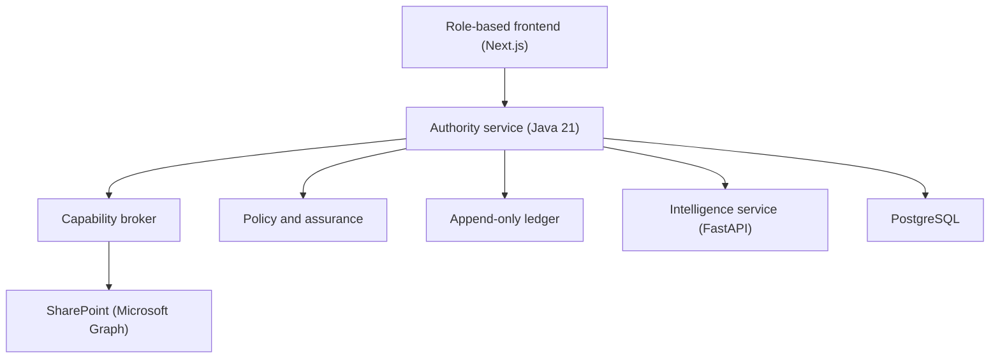

# SwarmSight

An experimental control plane for governing AI agents in public-sector workflows.

**Intelligence proposes. Authority decides. The ledger records.**

[Live demo](https://swarmsight-2t9m-iok6txap3-maryam-ai-devs-projects.vercel.app/) · [Why it exists](#why-swarmsight-exists) · [Core principle](#the-core-principle) · [Architecture](#architecture) · [Run locally](#run-locally) · [Thirty Labs](https://thirty-labs.com/)

> Experimental research project by Thirty Labs.
> SwarmSight is a working prototype, not a production-certified government system.


---

## Why SwarmSight exists

AI agents are moving from generating text to carrying out multi-step work.

That becomes more consequential in government. An agent working on housing
casework may encounter personal data, changing policy, and decisions that affect
a citizen directly.

The usual answer is to keep a human in the loop. But human involvement only
provides meaningful control when that person can see what the agent is doing,
understand which rules apply, and stop an action before it proceeds.

SwarmSight explores what the layer between AI capability and public-sector
authority could look like.

---

## The core principle

SwarmSight separates intelligence from authority.

| Layer | Responsibility |
|---|---|
| Intelligence | Interprets the case and proposes an action |
| Authority | Applies permissions, policy, and assurance rules |
| Human officer | Reviews consequential decisions |
| Ledger | Records what happened and why |

> The agent does not decide what it is authorised to do.

SwarmSight explores how unsafe actions can be constrained by architecture,
rather than discouraged through instructions alone.

---

## See it through one case

A housing case contains an eviction risk, dependent children, and sensitive
personal information.

1. The case enters through the authority layer.
2. Sensitive fields are masked before reaching the agent.
3. The agent prepares a proposed action.
4. The policy engine evaluates that proposal against the active rules.
5. A high-consequence case is held for an officer.
6. The officer receives a plain-English explanation.
7. The decision, policy version, and information access are recorded.

<!-- Screenshots worth adding for three moments:
     the officer's case view · a policy hold or escalation · a ledger entry -->

---

## How the governed workflow works

```
Case enters → Data is restricted → Agent proposes
   → Policy checks → Officer decides → Ledger records
```

Every action an agent takes passes through this sequence. The agent never sees
unmasked data, never checks its own permissions, and never has the final word.

---

## Core components

### Capability broker

Controls how agents access external systems and masks restricted fields before
data reaches the intelligence service. Masking is a per-field intersection of the
source system's own permission and the department's sensitivity policy.

### Versioned policy

Keeps workflow rules within the authority layer. The department holds an
append-only rulebook per workflow, and an agent is matched to the policy that
governs its task. Policy changes create new versions, so past decisions can be
traced to the rules active at the time. Policies are inferred from council
documents and UK legislation rather than hardcoded.

### Assurance arena

Runs policy-derived and adversarial scenarios against an agent before it receives
a certificate for a defined set of actions. A certificate carries a hard ceiling
(for example, "prepare and check only" — never send, close, or release).

### Append-only ledger

Records decisions, data access, policy versions, and review events in a
hash-linked audit trail, so an action can be examined after the fact.

---

## Architecture



The browser only ever talks to the frontend origin, which proxies API calls to
Authority server-side (no CORS, no token in the browser). The agent never calls
Intelligence directly — Authority is always the first stop, and the agent only
proposes.

- **`authority/`** — Java 21, Spring Boot, PostgreSQL 16, Flyway. Holds the
  ledger, the decisions, the capability broker, the policy engine, the arena, and
  auth. This is where verdicts are made and recorded.
- **`intelligence/`** — Python 3.12, FastAPI. The agent under assurance:
  `POST /agent/act` returns a *proposed* action. It reasons with Claude
  (`claude-opus-4-8`) when `ANTHROPIC_API_KEY` is set, and falls back to a
  deterministic safe agent otherwise, so the stack runs offline.
- **`frontend/`** — Next.js and React. Role-based desks (officer, head of
  department, service owner), a guided tour, and a live control tower.
- **`sample-sharepoint-docs/`** — local demonstration data used when no
  SharePoint tenant is configured.

---

## Scope and limitations

SwarmSight demonstrates an architectural approach to governing agents. It does
not prove that an AI system is universally safe.

The prototype can:

- Restrict agent access through a controlled broker
- Apply versioned workflow policy
- Test defined behaviours before deployment
- Require human review for selected decisions
- Record events in a tamper-evident chain

The prototype does not currently:

- Provide formal verification of every possible agent behaviour
- Replace legal, security, or equality-impact assessments
- Guarantee the correctness of inferred policy
- Prevent every failure outside its modelled boundaries
- Provide production certification for government deployment

---

## Repository structure

| Path | Contents |
|---|---|
| `authority/` | Authority service — broker, policy, arena, ledger, auth |
| `intelligence/` | Intelligence service — the agent under assurance |
| `frontend/` | Role-based web frontend |
| `sample-sharepoint-docs/` | Demonstration case and policy documents |
| `docker-compose.yml` | Authority, Intelligence, and PostgreSQL for local runs |
| `DEPLOY.md` | Step-by-step deployment checklist (Railway + Vercel) |
| `DECISIONS.md` | Design decision log |

---

## Run locally

### Requirements

- Docker and Docker Compose
- Node.js and npm
- Java 21 — only if running the authority service outside Docker
- Python 3.12 — only if running intelligence outside Docker

### Start the backend

```bash
docker compose up --build
```

Brings up Authority, Intelligence, and PostgreSQL. Authority runs Flyway
migrations and seeds the demo on first boot.

- Authority health: <http://localhost:8080/health>
- Intelligence health: <http://localhost:8000/health>

### Start the frontend

```bash
cd frontend
npm install
npm run dev
```

Open <http://localhost:3000> and sign in.

<details>
<summary>Demo accounts</summary>

Seeded on first boot when `swarmsight.demo-seed` is on (the default), using the
dev values in `docker-compose.yml`:

| Account | Email | Password | Sees |
|---|---|---|---|
| Officer | `officer@swarmsight.local` | `swarmsight-demo` | The live caseload |
| Head of dept | `head@swarmsight.local` | `swarmsight-demo` | Oversight, containment |
| Service owner | `owner@swarmsight.local` | `swarmsight-demo` | Policy inference, agent assurance |
| Admin | `admin@swarmsight.local` | `changeme-admin` | Account management |

These are **dev-only** values. In production, override `AUTH_JWT_SECRET`
(>= 32 bytes) and `AUTH_ADMIN_PASSWORD`, and set `swarmsight.demo-seed` off so no
demo accounts are seeded.

</details>

---

## Try the governed path

This example submits a housing action containing eviction risk and dependent
children. The authority layer should hold it for human review rather than letting
the agent proceed.

```bash
curl -X POST http://localhost:8080/decide -H 'Content-Type: application/json' -d '{
  "requestId": "demo-1", "runId": "run-1", "caseRef": "CASE-1",
  "actor": "agent-housing-1", "workflow": "HA-09", "action": "draft_response",
  "inputs": {"tenancy_status": "secure", "eviction_risk": true, "dependent_children": true}
}'
```

A case with eviction risk **and** dependent children is held for an officer with
a plain-English brief.

---

## Tests

| Component | Command | Coverage |
|---|---|---|
| Authority | `cd authority && mvn test` | Policy, broker, ledger, and decision paths |
| Intelligence | `cd intelligence && pip install -r requirements.txt && pytest` | Agent response and safe fallback behaviour |

Authority integration tests use Testcontainers, so a running Docker daemon is
required. The frontend does not have an automated test suite yet.

---

## Connecting live SharePoint (optional)

The `sharepoint-housing` connector reads live documents over Microsoft Graph when
configured, and falls back to an in-process mock otherwise — so the whole demo
runs with no tenant.

To go live, register an Entra app and grant it the **minimum** access it needs:
prefer `Sites.Selected` (scoped to the single site you grant) over
`Sites.Read.All`, which reads every site in the tenant. Then set:

```bash
SHAREPOINT_TENANT_ID=<directory (tenant) id>
SHAREPOINT_CLIENT_ID=<application (client) id>
SHAREPOINT_CLIENT_SECRET=<client secret value>
SHAREPOINT_SITE=contoso.sharepoint.com:/sites/Housing
SHAREPOINT_MODE=document
```

Drop application documents named with a case ref (for example,
`Housing-Application-HX-5821.txt`) into the site's library and they appear as live
cases.

- **Confirming the mode.** The log line `SharePoint connector: mode=..., graph=live`
  confirms live mode; `GET /sources/sharepoint/health` tests each Graph step and
  names any that fails.
- **What is masked.** Extraction runs *before* the permission mirror, so the agent
  still only ever sees the masked record (NI number masked, medical and unmapped
  fields denied) regardless of where the data came from.
- **Secrets.** `SHAREPOINT_CLIENT_SECRET` and the auth values are credentials.
  Keep them in environment variables or a secret store. `.env` files must not be
  committed — they are listed in `.gitignore`, and `.env.example` shows the shape
  without real values.

---

## Research context

SwarmSight is part of Thirty Labs' exploration of Human Control of Agentic
Systems:

> How can autonomous systems act while remaining governable?

The project investigates one possible adaptation layer between AI capability,
institutional policy, and human authority.

- [Thirty Labs](https://thirty-labs.com/)
- [SwarmSight live demo](https://swarmsight-2t9m-iok6txap3-maryam-ai-devs-projects.vercel.app/)
- Thirty Signals, Issue 001 — _add link_
- Architecture notes: [`DECISIONS.md`](DECISIONS.md), [`DEPLOY.md`](DEPLOY.md)

---

## Roadmap

- [ ] Expand policy-derived assurance scenarios
- [ ] Add clearer officer override and dissent records
- [ ] Introduce end-to-end observability
- [ ] Test additional public-sector workflows
- [ ] Evaluate usability with public-sector practitioners
- [ ] Document the threat model
- [ ] Add a frontend and end-to-end test suite

---

## Contributing

Issues, technical critiques, and research discussion are welcome.

## Licence

Licensed under the Apache License 2.0. See [`LICENSE`](LICENSE).

## About Thirty Labs

Thirty Labs is a product and research lab exploring how technology can adapt to
people, contexts, and institutions.

[thirty-labs.com](https://thirty-labs.com/)
